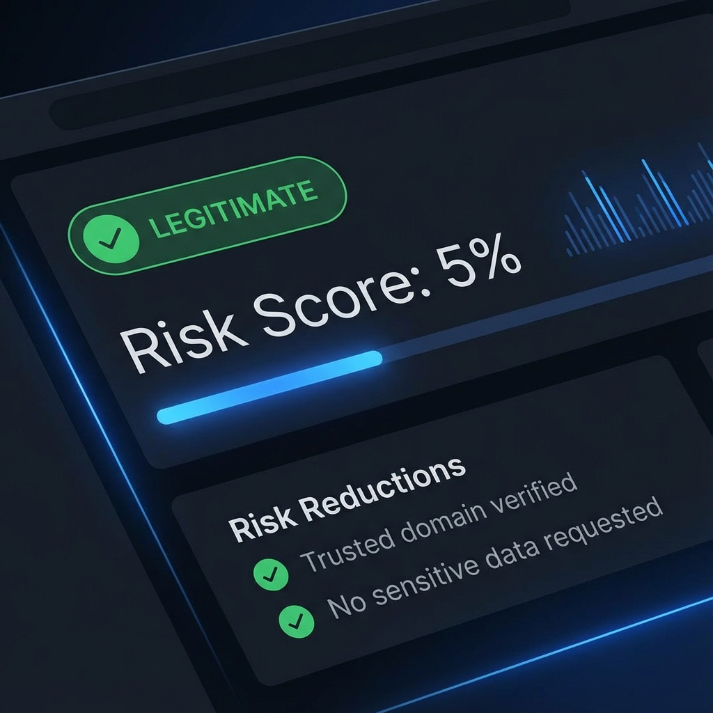

# Threat Detection Testing & Verification

This document highlights real-world examples analyzed using our **Hybrid Trust-Scoring** system.

## Detection Categories

Our system categorizes inputs into four distinct levels to reduce alarm fatigue and improve reliability.

### 1. Legitimate (Trust-Verified)

Messages or URLs from known brands like Airtel, HDFC, or Amazon that do not request sensitive credentials.

**Example:** `https://airtel.in/login`  
**Result:**

- **Category:** Legitimate
- **Risk Score:** 0%
- **Reductions:** Verified trusted brand, standard security (HTTPS).

### 2. Promotional (Information Only)

Marketing messages that might contain links but do not ask for OTPs or personal data.

**Example:** `Get 50% off on your next purchase! Visit our store today.`  
**Result:**

- **Category:** Promotional
- **Risk Score:** 12%
- **Explanation:** No credential request detected.

### 3. Suspicious (Needs Attention)

Messages from unknown sources that use urgent language but don't clearly request a login.

**Example:** `URGENT: Your account may have been accessed from a new device. Please check your activity.`  
**Result:**

- **Category:** Suspicious
- **Risk Score:** 45%
- **Explanations:** Urgent language used, unknown source.

### 4. Scam (High Risk)

Clear phishing attempts asking for OTPs, passwords, or using masked URLs.

**Example:** `Your HDFC account is suspended. Update KYC now at http://192.168.1.1/otp-verify`  
**Result:**

- **Category:** Scam
- **Risk Score:** 95%
- **Explanations:** Requests OTP, uses raw IP address instead of domain, unknown host.

## Technical Accuracy & Privacy

1. **Local Analysis:** All data is processed on the server without sending content to third-party APIs (excluding local AI model inference).
2. **Intent Analysis:** Our 'Intent Engine' looks for verbs and nouns associated with credential theft (OTP, login, CVV).
3. **Whitelisting:** We maintain a list of `trusted_domains.json` to automatically reduce false positives for major service providers.

> [!NOTE]  
> This system is advisory. Real-world threats evolve rapidly. Users are encouraged to always verify sensitive requests through official apps or helplines.
